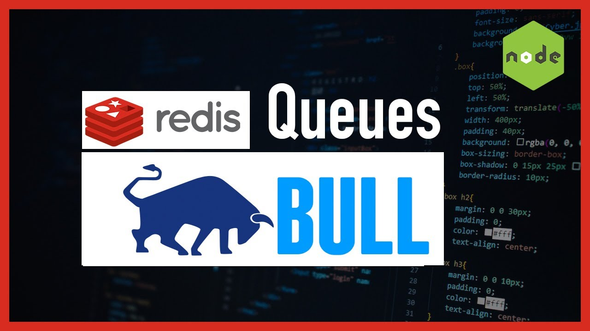

# Queue Producer and Worker

This is a simple example of using BullMQ to create a job queue for sending emails asynchronously. It consists of two main components: the producer and the worker.

## Producer (producer.js)

The producer script (`producer.js`) adds email sending jobs to the queue.

### Usage

1. Install dependencies: BullMQ
2. Run the producer script: node process.js
3. Run the worker script : node worker.js

Dependencies
* BullMQ: A Redis-backed job queue library for Node.js.